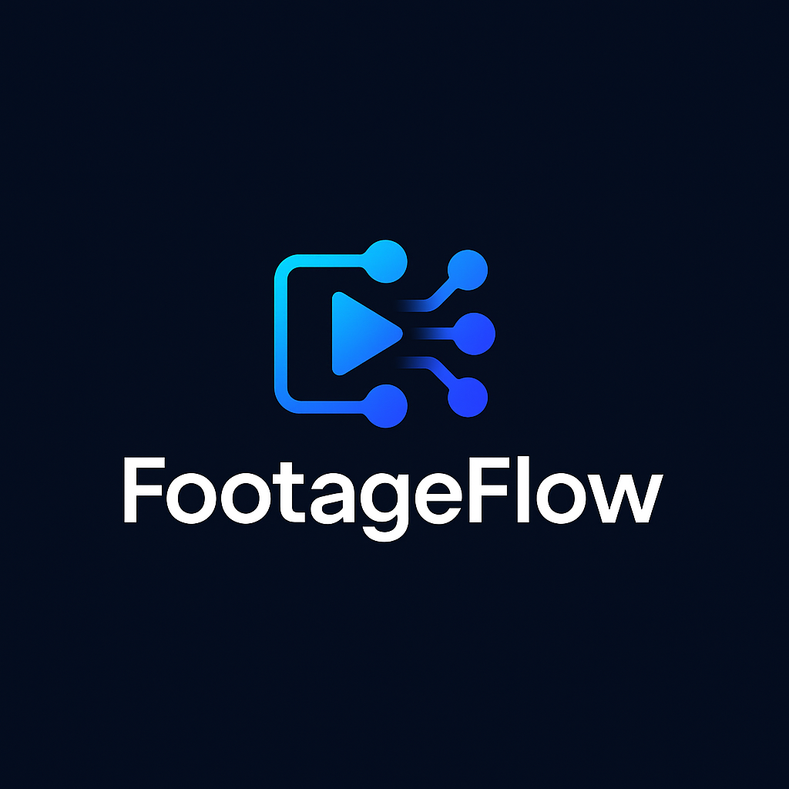

# FootageFlow - AI-Powered Video Management Platform

Transform your videos with artificial intelligence. FootageFlow is a cutting-edge video management platform that uses advanced AI to transcribe, analyze, and create compelling stories from your video content.

🌐 **Live Demo**: https://footage-flow-zeta.vercel.app

## ✨ What FootageFlow Can Do For You

### 🎙️ **Intelligent Transcription**
Transform speech to text with incredible accuracy using Groq Whisper API. Support for multiple languages including Hindi and English with precise timestamps.

### 🎬 **AI Video Story Generation**
Create professional video compilations automatically. Our AI analyzes your content and generates actual video files with smooth transitions - not just plans, but real videos you can download and share.

### 📖 **Creative Text Stories**
Generate compelling narratives from your video content. Our AI understands context and creates engaging stories based on what actually happens in your videos.

### 🏷️ **Smart Auto-Tagging**
Never lose track of your content again. AI automatically generates relevant tags for every video, making search and organization effortless.

### 🔍 **Powerful Search**
Find any moment in your videos instantly. Search by transcript content, tags, or even specific topics discussed in your videos.

### 📤 Video Management
- **Drag & Drop Upload**: Intuitive video upload with progress tracking
- **Cloudinary Integration**: Reliable cloud storage with automatic thumbnails
- **Video Processing**: Automatic AI analysis pipeline
- **Metadata Management**: Edit titles, descriptions, and organize content

### 🤖 AI-Powered Features
- **Smart Transcription**: AssemblyAI integration with speaker detection
- **Vision Analysis**: Gemini Vision API for automatic tagging
- **Content Recognition**: Objects, scenes, activities, emotions, and text detection
- **Natural Language Search**: Find videos using conversational queries
- **Story Generation**: AI-powered narrative creation from video clips

### 🎨 Enhanced UI/UX
- **Smooth Animations**: Framer Motion powered transitions
- **Spotlight Effects**: Dynamic lighting on interactive elements
- **Gradient Hover Effects**: Beautiful button and card interactions
- **Responsive Design**: Mobile-first approach with Tailwind CSS
- **Interactive Components**: Ripple effects, floating animations, and micro-interactions

## Tech Stack

### Backend
- Node.js with Express.js
- PostgreSQL (Neon.tech)
- Prisma ORM
- Google OAuth2 + JWT
- Cloudinary for video storage
- OpenAI GPT-4, Whisper
- Google Cloud Vision API
- AssemblyAI

### Frontend
- React with TypeScript
- Tailwind CSS
- Framer Motion
- React Router
- Axios

## 🚀 Quick Start

### Prerequisites
- Node.js 18+
- npm 8+
- Modern web browser (Chrome, Firefox, Safari, Edge)

## 📡 API Endpoints

### Authentication
- `GET /auth/google` - Initiate Google OAuth
- `GET /auth/google/callback` - OAuth callback
- `POST /auth/logout` - Logout user
- `GET /auth/me` - Get current user info

### Videos
- `GET /api/videos` - Get user videos with tags
- `GET /api/videos/:id` - Get single video details
- `PUT /api/videos/:id` - Update video metadata
- `DELETE /api/videos/:id` - Delete video and related data
- `GET /api/videos/search?query=...` - Basic video search

### Upload
- `POST /api/upload` - Upload video (triggers AI processing)
- `GET /api/upload/status/:videoId` - Get upload status

### AI Processing
- `POST /api/ai/transcribe/:videoId` - Start transcription
- `POST /api/ai/analyze/:videoId` - Start vision analysis
- `POST /api/ai/process/:videoId` - Start both transcription and vision
- `GET /api/ai/status/:videoId` - Get processing status
- `GET /api/ai/search?query=...&type=...` - Enhanced AI search
- `GET /api/ai/tags/stats` - Get tag statistics

### Stories
- `POST /api/stories/generate` - Generate new story
- `GET /api/stories` - Get user stories
- `GET /api/stories/:id` - Get single story
- `DELETE /api/stories/:id` - Delete story
- `GET /api/stories/:id/status` - Get story generation status
- `POST /api/stories/:id/regenerate` - Regenerate story
- `GET /api/stories/suggestions/prompts` - Get story prompt suggestions

## 🎯 How to Use FootageFlow

### **Getting Started**
1. **Visit**: https://footage-flow-zeta.vercel.app
2. **Sign In**: Use your Google account for instant access
3. **Start Creating**: Upload your first video and watch the magic happen!

### **Upload & Process Videos**
- **Upload**: Drag and drop video files or click to browse
- **AI Processing**: Watch real-time transcription and tagging
- **Explore Results**: View transcripts, tags, and video details

### **Generate AI Stories**
- **Text Stories**: Create compelling narratives from video content
- **Video Stories**: Generate actual video compilations with transitions
- **Custom Prompts**: Tell AI exactly what kind of story you want

### **Search & Organize**
- **Smart Search**: Find videos by transcript content or tags
- **Filter Options**: Sort by date, duration, or content type
- **Mobile Optimized**: Full functionality on all devices

## Contributing

1. Fork the repository
2. Create a feature branch
3. Make your changes
4. Test thoroughly
5. Submit a pull request

## License

MIT License - see LICENSE file for details
